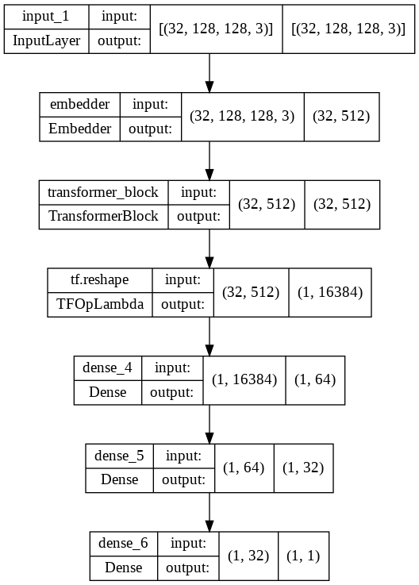

# A Different Video-Vision-Tranformer
In this repository lies the code for a Vision transformer for temporal data. The data I used is a video dataset from the Kinetics Dataset. I chose 2 classes Dribbling BasketBall and Dunking BasketBall as then the labels would be dependent on the action and not on just the contents of the video. I used Unifrom Frame Sampling to sample frames from around 220 total videos and stored them in a [drive](https://drive.google.com/drive/u/0/folders/1-1BGLNghpKtHQ0AdfsNyWThzy2HnEpBq). If you want to run the code directly please make a shortcut of this link in MyDrive. To extract and download the data, I have used a [premade code](https://github.com/Showmax/kinetics-downloader) and edited the json to download only the videos I want. I have also filtered some empty folders and hence obtained the final dataset with almost 1:2 split in the 2 classes. I tried to keep them unbalanced so as to mimic real world scenario of more dribbling data than basketball dunks!
 

I first used the uniformly sampled frames and parallelly passed them through the Embedder, Transformer Encoder and the MLP head for classification. The Embedder consists of a Flatten Layer, a hidden layer and another dense layer for transforming it to the dimensions we want. The Embedder itself has the largest amount of weights as I have fed the entire 128x128x3 Image in a flattened form. This is one of the reasons for a long training time. It can be partially combatted if we use CNN encoder which can be used from a pre-trained transfer model. This will however, cause a loss in the spatial features by introducing translational invariance. One can even use Capsule NN which may partially preserve the spatial features and also extract smaller dimentional features while embeddings.
 
 
My transformer encoder architecture heavily inspired form the one proposed in [ViVit](https://arxiv.org/pdf/2103.15691.pdf) with 2 LayerNormalisation layers and MultiHead Self Attention (MSA) layer.

I have used only one Transformer Block due to training time constraints, but increasing the number of transformerblocks will mostly help in increasing the accuracy. Finally I have fused the encoded vectors and passed them onto a MLP head which consists of Dense layers with Gelu activation. The final output layer consists of sigmoid activation to give the class labels. 

  
The training time for even 1 epoch is large due to large data and large model(thanks to the embedding layer). After training for just 2 epochs I could get an accuracy of 71.6% and an F1 score of 0.66 on 60 32-frame batches from the dataset. The current weights file(weights1) is also added to the same google drive link. I will try to train it for a longer duration and hopefully update the weights file soon! 
